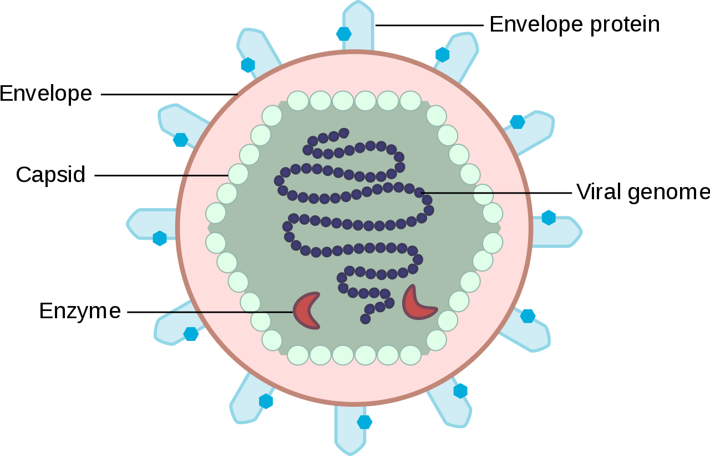

# Coronavirus Disease (COVID-19)

### To better understand what is Coronavirus (COVID-19), why is it spreading exponentially, why is it hard to combat, we would need to know what is a Virus, its structure and how it spreads.

### What is a VIRUS?

A virus is a biological agent that reproduces inside the cells of living hosts. When infected by a virus, a host cell is forced to quickly produce thousands of identical copies of the original virus. Unlike most living things, viruses do not have cells that divide; new viruses are assembled in the infected host cell. But unlike still simpler infectious agents like prions, viruses contain genes, which gives them the ability to mutate and evolve. Over 4,800 species of viruses have been discovered.

## VIRUS's structure

A virus consists of two or three parts: genes, made from either DNA or RNA, long molecules that carry genetic information; a protein coat that protects the genes; and in some viruses, an envelope of fat that surrounds the protein coat (which makes them vulnerable to soap) and is used, in combination with specific receptors, to enter a new host cell. 
Viruses vary in shape from the simple helical and icosahedral to more complex structures. Viruses range in size from 20 to 300 nanometres; it would take 33,000 to 500,000 of them, side by side, to stretch to 1 centimetre (0.39 in).

### Now after we have defined what is a Virus and its structure, we can take a closer look at Coronavirus (COVID-19)

## What is a coronavirus?

Coronaviruses are a large family of viruses which may cause illness in animals or humans.  In humans, several coronaviruses are known to cause respiratory infections ranging from the common cold to more severe diseases such as Middle East Respiratory Syndrome (MERS) and Severe Acute Respiratory Syndrome (SARS). The most recently discovered coronavirus causes coronavirus disease COVID-19.

## What is COVID-19.

COVID-19 is the infectious disease caused by the most recently discovered coronavirus. This new virus and disease were unknown before the outbreak began in Wuhan, China, in December 2019.
